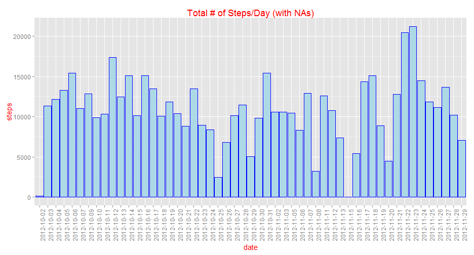
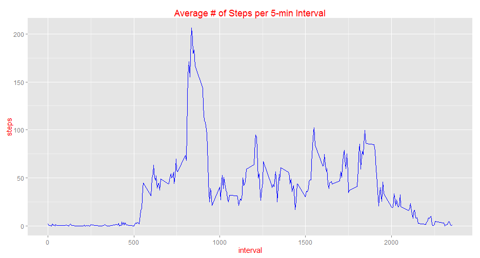
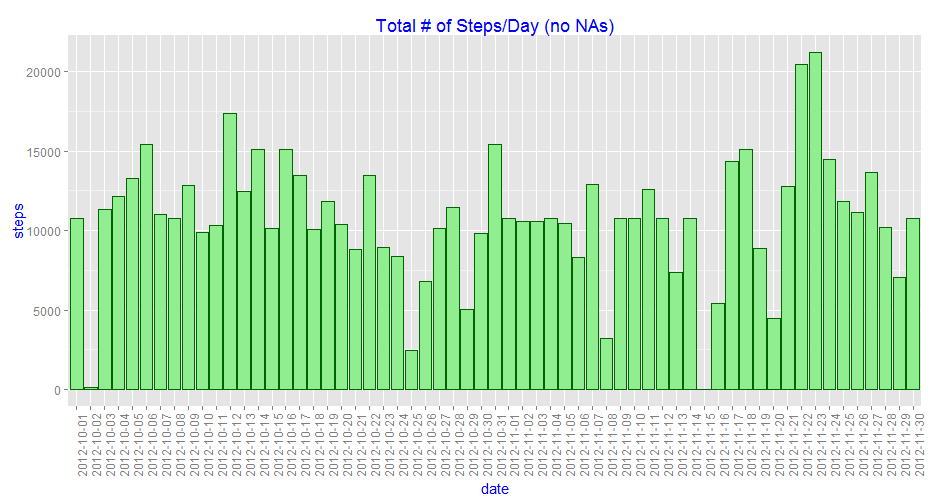
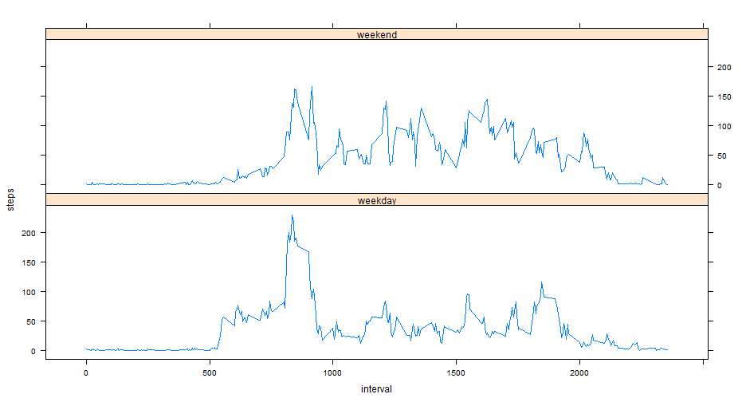

Reproducible Research: Peer Assessment 1
===========================================
## Introduction
The current report provides the answers to the Assessment 1 of the Reproducible Research course.

## 1. Loading and Preprocessing the Data
The code below loads that data needed for this analysis and tranforms it to a suitable format for the analysis.


```r
library(ggplot2)
library(lubridate)
library(lattice)

# Move to the project directory & load the data
setwd("C:\\epsychog\\Trainings & Events\\Data Science\\Data Science Specialisation (coursera)\\5. Reproducible Research\\RepData_PeerAssessment1")
data <- read.csv("activity.csv")

# Make a data frame with the total steps taken per day.  Ignore dates with
# missing (NA) values
stepsByDate <- aggregate(steps ~ date, data = data, sum, na.action = na.omit)

# Make a data frame with the steps taken per 5-min interval.  Ignore dates
# with missing (NA) values
stepsByIntAvg <- aggregate(steps ~ interval, data = data, mean, na.action = na.omit)
```


## 2. Total Steps per Day
The figure below is a histogram representing the total number of steps taken each day.

```r
ggplot(stepsByDate, aes(x = date, y = steps)) + geom_histogram(colour = "blue", 
    stat = "identity", fill = "lightblue") + theme(text = element_text(size = 15, 
    colour = "red"), axis.text.x = element_text(angle = 90, vjust = 1)) + labs(title = "Total # of Steps/Day (with NAs)")
```

 


### MEAN & MEDIAN of the Total # of Steps per Day (with missing values)

```r
mean1 <- mean(stepsByDate$steps)
median1 <- median(stepsByDate$steps)
```

The MEAN of the total # steps per day is (with missing values): **1.0766 &times; 10<sup>4</sup>**
The MEDIAN of the total # steps per day is (with missing values): **10765**

## 3. Average Daily Activity Pattern
The figure below is a time series plot of the 5-minute interval (x-axis)
and the average number of steps taken, averaged across all days (y-axis)


```r
ggplot(stepsByIntAvg, aes(x = interval, y = steps)) + geom_line(colour = "blue") + 
    labs(title = "Average # of Steps per 5-min Interval") + theme(text = element_text(size = 15, 
    colour = "red"))
```

 

```r

topInt <- stepsByIntAvg$interval[stepsByIntAvg$steps == max(stepsByIntAvg$steps)]
```

The 5-minute interval, on average across all the days in the dataset,
contains the maximum number of steps is: **835**

## 4. Imputing Missing Values
From the initial examination of the data we can see that there are a number of days/intervals where there are no steps recored and the value is missing (coded as NA). The presence of missing days may introduce bias into some calculations or summaries of the data.

In this section we describe the strategy applied for filling in missing values in the data set. 

### Total # of Missing Values

```r
totalNA <- sum(is.na(data))
```

The total number of missing values in the dataset is: **2304**

### Fill in Missing Values
We fill in the missing values using the mean number of steps taken for that 5-minute interval. The result is a new dataset that is equal to the original dataset but with the missing data filled in.


```r
# Create a new dataset that we will fill the missing values
dataNoNA <- data

# Replace the NA values with the mean number of steps for that interval.
for (i in 1:length(data$steps)) {
    if (is.na(data$steps[i])) {
        dataNoNA$steps[i] <- stepsByIntAvg$steps[stepsByIntAvg$interval == data$interval[i]]
    }
}
```


The figure below is a histogram representing the total number of steps taken each day using the dataset without missing values.

```r
# Make a data frame with the total steps taken per day.
stepsByDate2 <- aggregate(steps ~ date, data = dataNoNA, sum, na.action = na.omit)

ggplot(stepsByDate2, aes(x = date, y = steps)) + geom_histogram(colour = "darkgreen", 
    stat = "identity", fill = "lightgreen") + theme(text = element_text(size = 15, 
    colour = "blue"), axis.text.x = element_text(angle = 90, vjust = 1)) + labs(title = "Total # of Steps/Day (no NAs)")
```

 


### MEAN & MEDIAN of the Total # of Steps per Day (without missing values)

```r
mean2 <- mean(stepsByDate2$steps)
median2 <- median(stepsByDate2$steps)
```

The MEAN of the total # steps per day is (without missing values): **1.0766 &times; 10<sup>4</sup>**
The MEDIAN of the total # steps per day is (without missing values): **1.0766 &times; 10<sup>4</sup>**

We notice that the mean values are the same while the median values differ from the first part of the assignment. In addition, the histogram with the total daily number of steps now includes all the (61) days in the 2 month period included in the data.

## 5. Activity patterns between WeekDAYS and WeekENDS

```r
# Ensure the days of the week appear in English
Sys.setlocale(locale = "C")
```

```
## [1] "C"
```

```r

# Create a new factor variable in the dataset with two levels – “weekday”
# and “weekend” indicating whether a given date is a weekday or weekend.
dataNoNA$we[weekdays(as.Date(dataNoNA$date)) %in% c("Saturday", "Sunday")] <- "weekend"
dataNoNA$we[!weekdays(as.Date(dataNoNA$date)) %in% c("Saturday", "Sunday")] <- "weekday"
dataNoNA$we <- as.factor(dataNoNA$we)
```


From the plot below we see that during the weekend the activity starts later in the day. In addition, during the week there is a lot of activity between 8 and 10 in the morning and then the activity dies down for the rest of the day. On the contrary the activity during the weekend is increased and last during the whole day.
Are there differences in activity patterns between weekdays and weekends?

```r
stepsByIntAvg2 <- aggregate(steps ~ interval + we, data = dataNoNA, mean)
xyplot(steps ~ interval | we, data = stepsByIntAvg2, type = "l", layout = c(1, 
    2))
```

 

